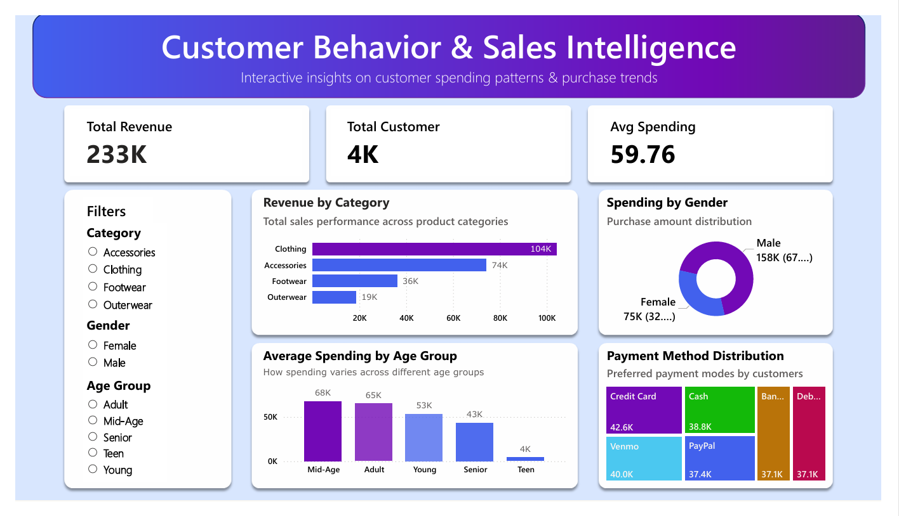

📊 Customer Behavior & Sales Insights Dashboard

📌 Project Overview
This project analyzes customer purchasing behavior and sales trends using data analytics tools.

🛠 Tools Used
- Python (Pandas, NumPy)
- SQL (SQLite)
- Power BI

🔍 Key Insights
- Identified top-performing product categories
- Analyzed customer spending patterns
- Compared behavior across age groups and gender

📊 Dashboard

🚀 Conclusion
This project demonstrates end-to-end data analysis, from cleaning and processing data to building interactive dashboards.
